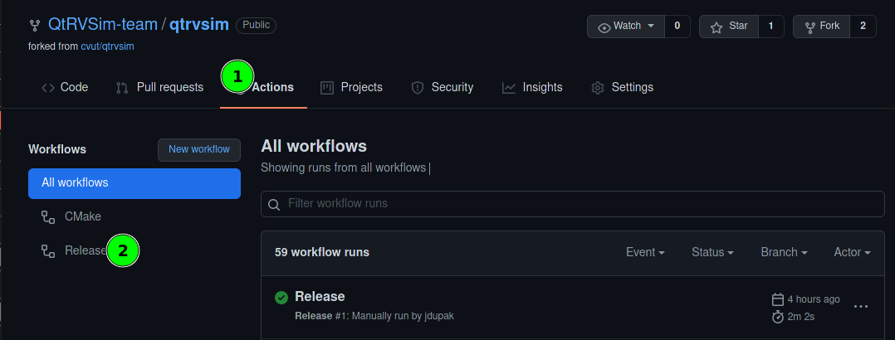
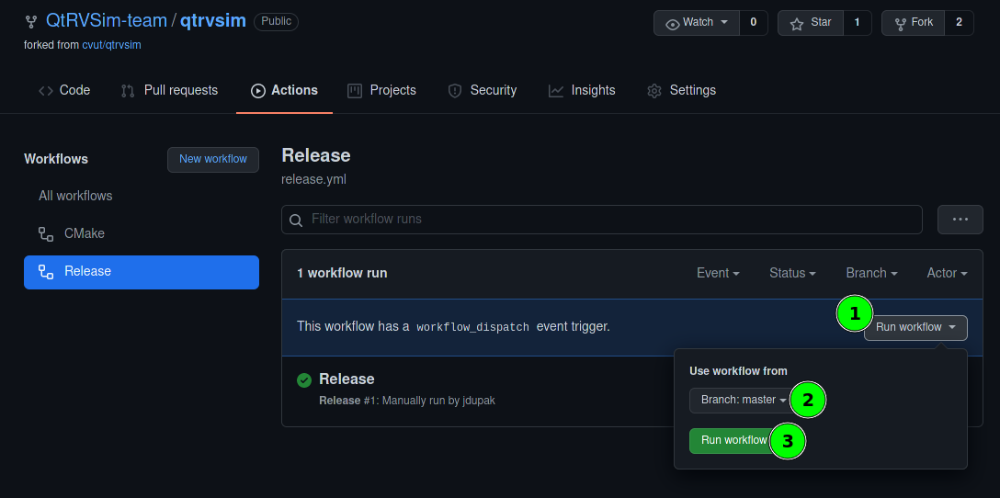
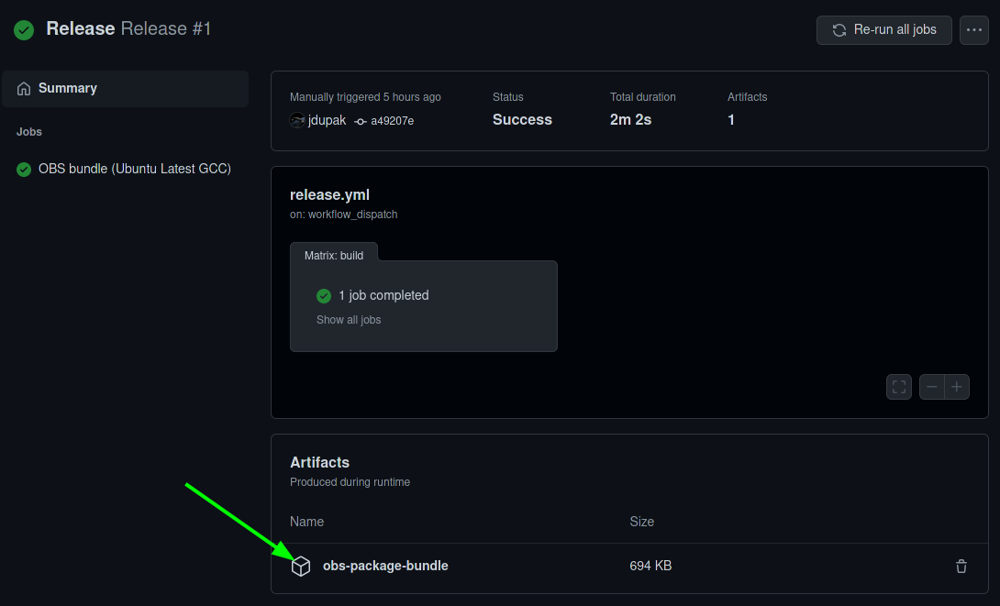

# Release process

- Check version in root `CMakeLists.txt`
- Update debian changelog
- Make sure, CMake was configured with flag `-DDEV_MODE=true` to enable packaging tools. Without this flag, CMake will
  not try to do anything, that would require an external tool.
- Run `make open_build_service_bundle`.
- Deploy the contents of `<build_dir>/target/pkg` to Open Build Service (and Launchpad).

## Debian changelog

Debian changelog has very strict (and little weird) format. Bash script `extras/packaging/add-to-changelog.sh
<version>` generates a new entry in the changelog and opens it in `$EDITOR`. Edit CAREFULLY, the format is fragile.
After that, changes are committed and git tag is updated.

### TODO

- Decide, whether this should be replaced with CMake.
- Get version from CMake

## `open_build_service_bundle` target

At configure time, package related files are injected with up to date information from CMake (variables prefixed
`PACKAGE_`) and copied to `<executable output directory>`/`pkg`. This target bundles sources to `tar.xz` and updates
hashes in the package files.

### Generate using GitHub Actions (CI)

In the repository page at GitHub go to actions tab and choose release in the left menu.



Click `run workflow` and select a branch.



One the workflow has finished, the bundle is to be found in the artifacts section. Upload this bundle to OBS.



### TODO

- Package signing

## Open Build Service

The easiest way to deploy files to OBS is the `osc` cli tool.

- Setup credentials. The first run of `osc` will lead you.
- Download the repository:

```shell
osc co home:jdupak qtrvsim
```

- Copy files to `home:jdupak`/`qtrvsim`.
- Add files to tracking (in the `qtrvsim` directory):

```shell
osc addremove *
```

- Commit changes and push:

```shell
osc commit
```

- If something went wrong, delete th directory and start from th beginning.

