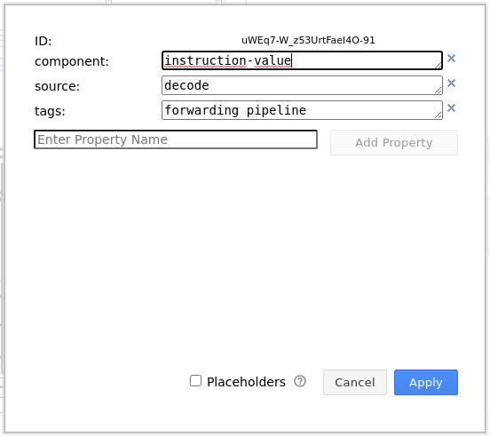
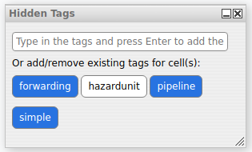

# Using .drawio diagram

For easier manipulation the coreview diagrams are created i a diagramming tool [diagrams.net](https://app.diagrams.net),
formerly known as __draw.io__. It is fully sufficient to use it in browser, but installable version is available as
well.

## Prepare your workspace

Before you begin and open the diagram, you have to enable some plugins in menu `Extra`/`Plugins...`. Tou will
need `tags`. Choose it and reload the app.

You will need to enable the tools `Tabs` and `Hidden Tabs` in the `Extras` menu. I also recommend enabling `Layers` tool
in view.

## Export

You have to export 3 SVG files.

In the `Tags` window, empty the field and click `Hide`. Everything will disappear. Then type `simple` and click show. It
will show only components tagged as simple. No hit `File`/`Export as...`/`SVG...`. Uncheck
the `include a copy of diagram` option and git export. Save as `simple.svg`
to `device` and move it to project directory (`src/gui/core`). Hit hide and repeat for other versions (
currently `simple`,`pipeline` and `forwarding`).

## Editing

You can load the diagram from device or from GitHub. Device is preferred as it will not create many useless commits. All
shapes I have used are on [my GitHub](https://github.com/jdupak/Diagrams.net-CPU-scheme-kit). You can open it in `File`
/`Open library from`. If you need write access just open an issue.

The editor itself is quite intuitive, so here are only special functions and highlights:

- When using texts, make sure, that formatted text option is disabled. It would use SVG foreign objects, which are not
  supported in most simple renderers and parsers. The option is cca in the middle of the text tab on the right.
- If you need to ensure that some elements are inside others in the resulting SVG, you have to use `Custom element`,
  otherwise the SVG is flattened. Currently, it is how cache works. In the style tab, you can see inspect it by the `
  edit shape` button. Make sure to select the element and not some group. You can create new one in 
  `Arrange`/`Insert`/`Shape...`. The language is 
  similar to SVG but not
  the same, and it is documented here: [https://www.diagrams.net/doc/faq/shape-complex-create-edit](https://www.
  diagrams.net/doc/faq/shape-complex-create-edit) with complete language reference
  here: [https://jgraph.github. io/mxgraph/docs/stencils.xsd](https://jgraph.github.io/mxgraph/docs/stencils.xsd). This
  is the code of the cache:
  ```xml
    <shape name="cache" h="50" w="60" aspect="fixed" strokewidth="inherit">
      <background>
        <roundrect x="0" y="0" w="60" h="50" arcsize="2" />
      </background>
      <foreground>
        <fillstroke />
        <fontsize size="6" />
        <fontstyle style="1" />
        <fontfamily family="sans-serif" />
        <text str="Cache" x="30" y="10" align="center" />
        <text str="Hit:" x="5" y="25" align="left" />
        <text str="Miss:" x="5" y="34" align="left" />
        <text str="0" x="20" y="25" align="left" />
        <text str="0" x="25" y="34" align="left" />
      </foreground>
    </shape>
  ```
- Components with dynamic values are created in `Edit data` in context menu (`CTRL+M`). Example (written here as a
  json):
  ```json
    {
      "component": "instruction-value",
      "source": "decode"
    }
  ```
  Components are handled in `src/gui/coreview/scene.cpp`, defined in `src/gui/coreview/domponents` and data bindings
  (source attribute) are controlled in `src/gui/coreview/data.h`.
  .
- In context menu - `Edit link...` you can create hyperlinks, what will open some part of gui on doubleclick. The
  connect to `CoreViewScene` signals using table in `src/gui/coreview/data.h`.
- To control in which variant the given element appears, you can use `tags` in `Edit data` of gui tool, which can be
  displayed in `Extras`/`Hidden tags...`
  .
