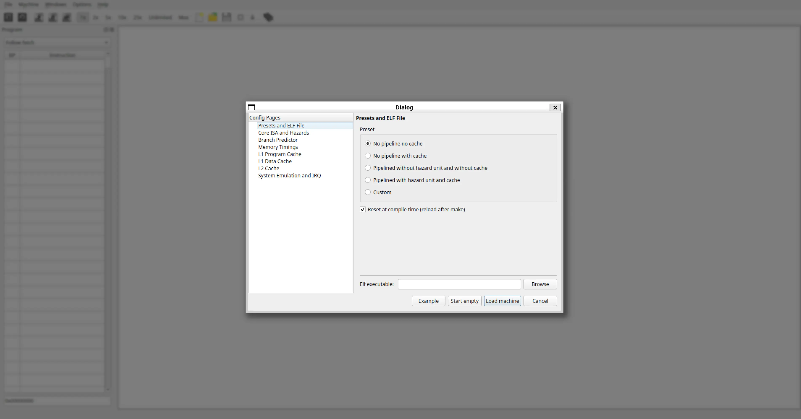

# First Launch

When you start QtRvSim, or when you select **`File > New Simulation`**, the **Pre-sets and ELF File** dialog will appear.
This dialog allows you to select a hardware configuration (pre-set) and, optionally, load a program to run.

## Dialog Options

- **Config Pages (Left Pane)**
  Displays the different categories of hardware settings (ISA, caches, etc.).
  For now, focus on the **Pre-sets and ELF File** page.
  The other pages will be covered in later chapters.

- **Pre-set (Radio Buttons)**
  Choose a predefined hardware configuration:
  - **No pipeline, no cache**: Simplest single-cycle processor model without cache memory. Ideal for learning basic instruction behavior.
  - **No pipeline, with cache**: Single-cycle processor with cache enabled.
  - **Pipelined, no hazard unit, no cache**: Classic 5-stage pipeline without automatic hazard handling. Useful to demonstrate data/control hazards. No cache.
  - **Pipelined, hazard unit, with cache**: More realistic 5-stage pipeline with hazard detection/forwarding enabled, plus caches.
  - **Custom**: Advanced mode – configure settings manually through the other Config pages.

- **Reset at compile time (reload after make)**
  If enabled, the simulator automatically reapplies the selected configuration each time you assemble a program.
  *Recommended: Keep this option checked.*

- **ELF Executable**
  Use the **Browse** button to load a precompiled RISC-V ELF program (`.elf`).
  *Tip: For most workflows, you’ll write and assemble assembly (`.s`) code directly in the editor instead.*

- **Action Buttons**
  - **Example**: Loads a default example assembly program into the editor with the selected pre-set. *This is the easiest way to get started.*
  - **Start empty**: Opens the simulator with the selected pre-set and an empty editor, ready for you to write or load code.
  - **Load machine**: Applies the selected pre-set and loads the chosen ELF executable.
  - **Cancel**: Closes the dialog without applying changes.

---

For your first run, we recommend selecting either:
- **`No pipeline, no cache`** (simplest model), or
- **`Pipelined with hazard unit and cache`** (closer to a realistic processor).

Then click **`Example`** (to load a sample program) or **`Start empty`** (to write your own).

For this manual, we’ll begin with **`Start empty`** and the **`No pipeline, no cache`** configuration.
