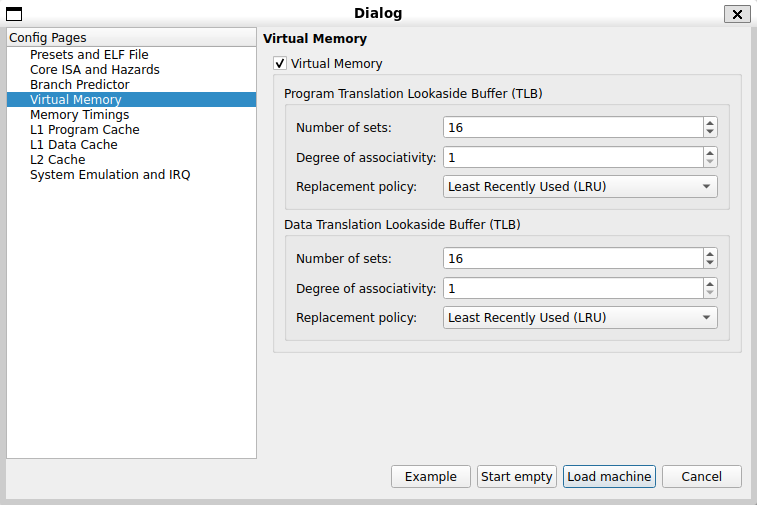

### Machine Configuration

QtRvSim allows different processor configurations to be selected through a configuration dialog window. This dialog is shown at application startup and can also be reopened when restarting the simulated machine.

The configuration defines key properties of the simulated system, including enabled hardware features and their parameters. These settings determine the initial state of the simulator before execution begins.

---

#### Virtual Memory Configuration

The virtual memory configuration section allows users to configure Translation Lookaside Buffer (TLB) parameters for the simulated machine.

The configurable parameters include the number of TLB sets, associativity, and the replacement policy used for TLB entry eviction.