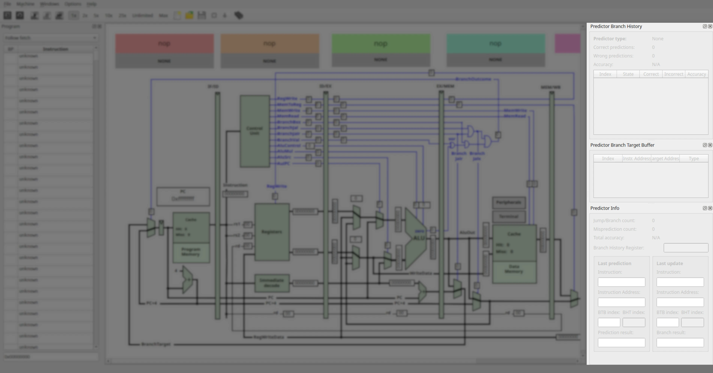
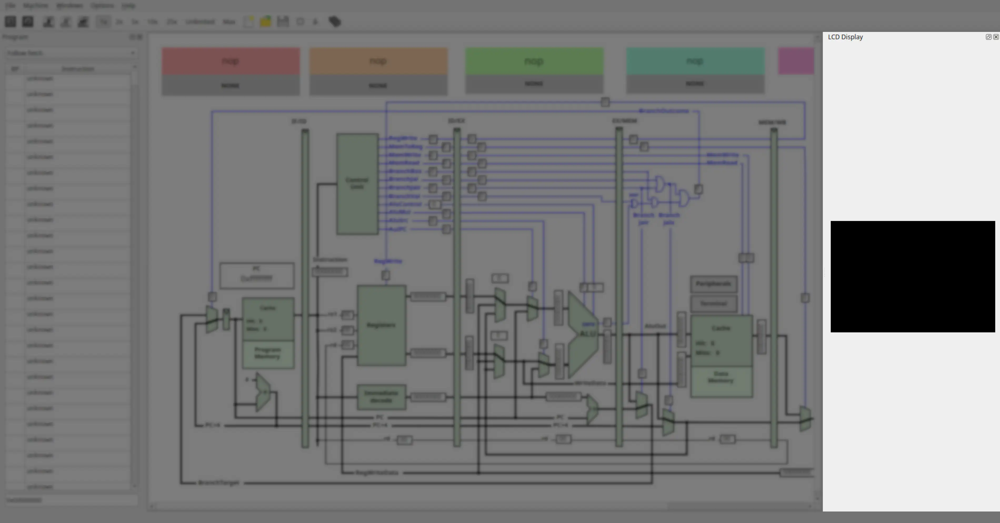
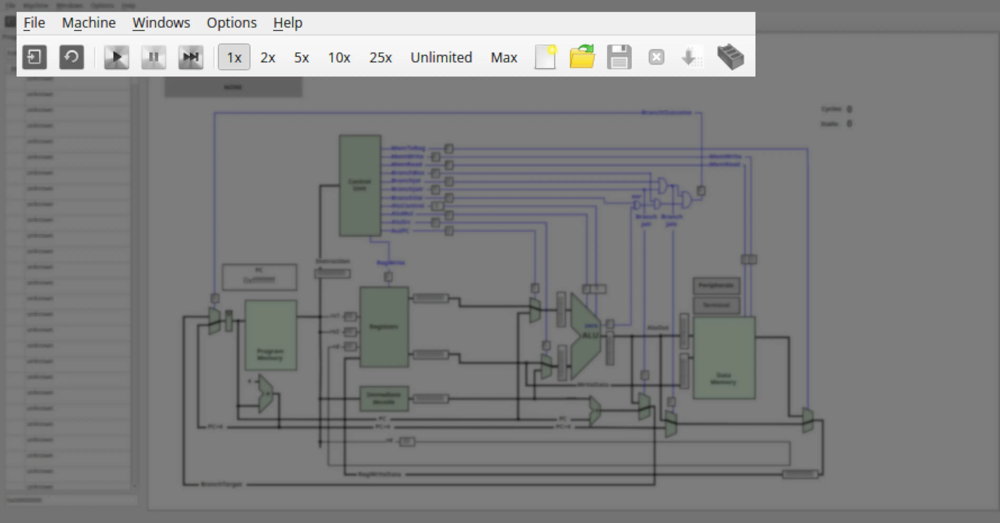

### Menu Bar

The menu bar provides access to all features of QtRvSim. It is divided into standard menus: **File**, **Machine**, **Windows**, **Options**, and **Help**.

---

#### File Menu
Handles operations related to simulation setup, source files, and the application itself.

-  **New simulation...** (Ctrl+N)
  Opens the *Pre-sets and ELF File* configuration dialog to start a new simulation.
-  **Reload simulation** (Ctrl+Shift+R)
  Reassembles the source code currently in the editor and resets the simulation state (registers, memory, cycle count).
- **Print** (Ctrl+Alt+P)
  Prints the contents of the active panel or editor.
-  **New source** (Ctrl+F)
  Opens a new editor tab to write a fresh assembly program.
-  **Open source** (Ctrl+O)
  Loads an existing RISC-V assembly source file (`.s`) into the editor.
-  **Save source** (Ctrl+S)
  Saves the current editor contents. If previously unsaved, behaves like "Save source as."
- **Save source as**
  Prompts for a filename and saves the editor contents to that path.
-  **Close source** (Ctrl+W)
  Closes the current editor tab (prompts to save unsaved work).
- **Examples**
  Opens a submenu of example RISC-V programs bundled with QtRvSim. Selecting one loads it into the editor.
-  **Exit** (Ctrl+Q)
  Exits the QtRvSim application.

---

#### Machine Menu
Controls simulation execution and machine-specific options.

-  **Run** (Ctrl+R)
  Starts continuous execution at the configured speed.
-  **Pause** (Ctrl+P)
  Halts execution if running.
-  **Step** (Ctrl+T)
  Executes only one instruction.
- **Speed Controls**
  Set the execution rate when using **Run**:
  - 1 instruction/s (Ctrl+1)
  - 2 instructions/s (Ctrl+2)
  - 5 instructions/s (Ctrl+5)
  - 10 instructions/s (Ctrl+0)
  - 25 instructions/s (Ctrl+F5)
  - Unlimited (Ctrl+U) – fastest possible speed
  - Max (Ctrl+A) – fastest speed, with reduced GUI updates (higher performance)
- **Restart**
  Resets registers, memory, peripherals, and counters to state after the last assembly.
- **Mnemonics Registers** (checkbox)
  Toggle register view to show mnemonic names (`ra`, `sp`) instead of raw (`x1`, `x2`).
- **Show Symbol**
  ? to be added ?
-  **Compile Source** (Ctrl+E)
  Assembles source code in the editor using the built-in assembler.
-  **Build Executable** (Ctrl+B)
  Builds a standalone ELF file using an external RISC-V toolchain (e.g., GCC/Clang).

#### Windows Menu
Manages visibility of all simulation panels.

- **Registers** (Ctrl+D) – Register state viewer.

- **Program** (Ctrl+P) – Code view with current instruction highlighting.

- **Memory** (Ctrl+M) – Memory contents.

- **Program Cache** (Ctrl+Shift+P) – Instruction cache visualization (if enabled).

- **Data Cache** (Ctrl+Shift+M) – Data cache visualization (if enabled).

- **L2 Cache** – Second-level cache view (if enabled).

- **Branch Predictor** – Displays prediction tables and data (if configured).

- **Peripherals** – Container for simulated I/O devices.

- **Terminal** – Simulated serial terminal.

- **LCD Display** – Simulated LCD.

- **Control and Status Registers (CSR)** (Ctrl+I) – CSR panel.

- **Core View** – Datapath visualization (CPU core).

- **Messages** – Log and feedback panel.

- **Reset Windows** – Restores all panels to their default positions.

---

#### Options Menu
- **Show Line Numbers** (checkbox) – Toggle line numbers in the code editor.

---

#### Help Menu
Provides information about QtRvSim, version details, and licensing.

---

### Toolbar

The toolbar provides quick access to frequently used actions:

-  **New Simulation** – Equivalent to *File → New simulation...* (Ctrl+N).
-  **Reload** – Resets simulator state (equivalent to *Machine → Restart*).
-  **Run** – Start program execution (Ctrl+R).
-  **Pause** – Pause execution (Ctrl+P).
-  **Step** – Execute one instruction (Ctrl+T).
- **Speed Controls** – Select execution speed (same as *Machine → Speed Controls*).
-  **New Source** – Open a new editor tab (Ctrl+F).
-  **Open Source** – Load an existing `.s` or `.elf` file (Ctrl+O).
-  **Save Source** – Save current file (Ctrl+S).
-  **Close Source** – Close active code editor tab (Ctrl+W).
-  **Compile Source** – Assemble current RISC-V program with the built-in assembler (Ctrl+E).
-  **Build Executable** – Build ELF with external RISC-V toolchain (Ctrl+B).
